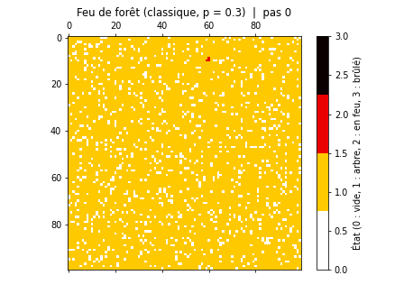
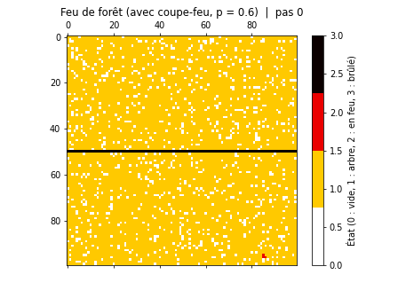
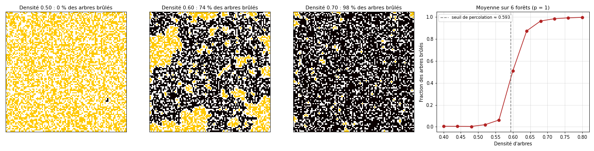
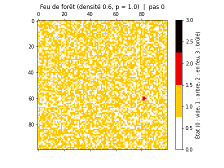

# Propagation d'un feu de forêt : automate cellulaire et percolation

Modélisation de la propagation d'un incendie dans une forêt par un **automate cellulaire**, avec deux questions : un **coupe-feu** (bande de forêt brûlée à l'avance) arrête-t-il l'incendie, et comment la **densité d'arbres** décide-t-elle si le feu s'éteint ou ravage toute la forêt ? La seconde question mène à un phénomène critique bien connu, la **percolation**.

| Feu classique | Avec coupe-feu |
|---|---|
|  |  |

*Jaune : arbre ; rouge : arbre en feu ; noir : arbre brûlé ; blanc : case vide. À droite, la ligne 50 est brûlée avant le départ du feu. Chaque animation va jusqu'à l'extinction de l'incendie, puis marque une pause sur l'état final.*

> **En bref**
> - Grille de 100 × 100 cellules ; chaque arbre voisin d'un arbre en feu s'enflamme avec une probabilité $p$.
> - Une seule ligne brûlée à l'avance suffit à protéger toute une moitié de la forêt, même avec une propagation forte.
> - Avec une propagation certaine, le feu brûle moins de 7 % des arbres jusqu'à une densité de 0,56, et plus de 87 % dès 0,64 : c'est une transition de percolation, au seuil théorique de 0,593.

## 1. Objectif

- Simuler la propagation d'un feu en fonction de la **densité** de la forêt et de la **probabilité de propagation**.
- Modéliser une technique de lutte contre les incendies : la **barrière de feu contrôlé**.
- Visualiser la dynamique de l'incendie sous forme d'animation.

Le modèle néglige volontairement le vent, l'humidité, le relief ou le type de végétation, pour se concentrer sur l'effet de la densité et de la probabilité de propagation.

## 2. Les automates cellulaires

Un automate cellulaire, concept introduit par John von Neumann dans les années 1940, repose sur trois éléments :

1. **une grille** de cellules, ici une forêt de $100 \times 100$ parcelles ;
2. **un ensemble fini d'états** pour chaque cellule ;
3. **des règles de transition locales** : l'état futur d'une cellule ne dépend que de son état et de celui de ses voisines.

Malgré leur simplicité, ces règles locales peuvent produire des comportements globaux complexes. L'exemple le plus célèbre est le Jeu de la vie de John Conway (1970).

## 3. Le modèle

### États

| Valeur | État | Couleur |
|---|---|---|
| 0 | vide (pas d'arbre) | blanc |
| 1 | arbre sain | jaune |
| 2 | arbre en feu | rouge |
| 3 | arbre brûlé | noir |

### Règles de transition

À chaque pas de temps, en parallèle sur toute la grille :

- un **arbre en feu** brûle pendant `duree_feu = 3` pas, puis devient **brûlé** ;
- un **arbre sain** ayant au moins une voisine en feu (voisinage de von Neumann : haut, bas, gauche, droite) s'enflamme avec la probabilité $p$ (`coef_propagation`) ;
- les cases **vides** et les arbres **brûlés** ne changent plus : ils ne transmettent pas le feu.

Un arbre en feu reste actif pendant 3 pas, donc un arbre voisin a plusieurs occasions de s'enflammer. Pour un seul voisin en feu, la probabilité de transmission sur toute sa durée de combustion vaut $q = 1 - (1 - p)^3$ : environ 0,66 pour $p = 0{,}3$, et 0,94 pour $p = 0{,}6$.

### Initialisation

- Chaque cellule reçoit un arbre avec la probabilité `densite_forets` (0,9 par défaut), sinon elle est vide.
- Scénario **coupe-feu** : la ligne 50 est entièrement mise à l'état brûlé.
- Un arbre sain est choisi au hasard et mis en feu : c'est le départ de l'incendie.

## 4. Implémentation

| Fonction | Rôle |
|---|---|
| `initialiser_foret(N, densite, coupe_feu)` | tire la forêt, place le coupe-feu éventuel, allume un arbre au hasard |
| `propager_feu(foret, temps_feu, p)` | applique un pas de l'automate ; la matrice `temps_feu` compte le nombre de pas restants pour chaque arbre en feu |
| `simulation(p, coupe_feu, densite, titre, fichier_gif)` | animation Matplotlib (`FuncAnimation`) jusqu'à l'extinction du feu, affichée ou enregistrée en GIF |
| `feu_complet(densite, p)` | fait brûler une forêt jusqu'à extinction, sans affichage, et renvoie la fraction d'arbres brûlés |
| `effet_densite()` | étude de la densité : états finaux pour 3 densités et courbe moyennée sur 6 forêts par densité |

La nouvelle grille est calculée à partir d'une copie de l'ancienne : toutes les cellules évoluent simultanément, sans que l'ordre de parcours influence le résultat.

| Paramètre | Valeur | Rôle |
|---|---|---|
| `N` | 100 | taille de la grille |
| `densite_forets` | 0,9 | proportion de cellules contenant un arbre |
| `coef_propagation` | 0,3 (classique), 0,6 (coupe-feu), 1 (étude de densité) | probabilité d'inflammation par pas |
| `duree_feu` | 3 | nombre de pas pendant lesquels un arbre brûle |
| `LIGNE_COUPE_FEU` | 50 | ligne brûlée à l'avance |

## 5. Résultats

### Feu classique ($p = 0{,}3$, densité 0,9)

Le feu progresse de proche en proche avec un **front irrégulier**, laissant derrière lui des arbres épargnés. Dans l'animation, il s'éteint après environ 270 pas, en ayant brûlé 86 % des arbres. La propagation étant aléatoire, chaque exécution sans graine fixe donne un incendie différent ; il arrive même, rarement, que le feu s'éteigne dès les premiers pas si les premiers tirages sont défavorables.

### Coupe-feu ($p = 0{,}6$, densité 0,9)

Malgré une propagation deux fois plus forte, l'incendie s'arrête net sur la ligne brûlée : la moitié de la forêt située de l'autre côté reste intacte (50 % des arbres brûlés). Un arbre brûlé ne transmettant pas le feu, une seule rangée suffit à couper toute connexion entre les deux moitiés de la forêt. C'est le principe du feu tactique utilisé par les pompiers.

### Effet de la densité : la percolation



Avec une propagation certaine ($p = 1$), le feu brûle exactement l'**amas** d'arbres connectés au point de départ. La question « le feu traverse-t-il la forêt ? » devient « existe-t-il un chemin d'arbres voisins d'un bord à l'autre ? ». C'est le problème de la **percolation de sites** sur réseau carré, dont le seuil est connu : $p_c \approx 0{,}5927$.

| Densité | 0,48 | 0,52 | 0,56 | 0,60 | 0,64 | 0,68 | 0,72 |
|---|---|---|---|---|---|---|---|
| Arbres brûlés (moyenne sur 6 forêts) | 0,3 % | 1,9 % | 6,2 % | 50,9 % | 87,4 % | 96,4 % | 98,5 % |

- **Sous le seuil**, les amas d'arbres sont petits et isolés : le feu s'éteint après avoir brûlé quelques arbres (à gauche de la figure, densité 0,50 : presque rien ne brûle).
- **Près du seuil**, l'amas atteint a une forme ramifiée et lacunaire, caractéristique des objets critiques (densité 0,60 : 74 % des arbres brûlés dans cet exemple, avec de grandes poches épargnées).
- **Au-dessus du seuil**, un amas géant traverse la forêt et presque tout brûle (densité 0,70 : 98 %).

L'animation ci-dessous montre un feu à la densité 0,6, juste au-dessus du seuil, avec $p = 1$. Le front ne progresse plus en ligne : il serpente le long des chemins d'arbres connectés, contourne de grandes zones qu'il ne peut pas atteindre, et laisse une forme lacunaire typique d'un amas de percolation près du seuil (54 % des arbres brûlés).



La transition est très nette, et elle se produit bien au seuil théorique. Sur une grille infinie, la fraction brûlée resterait nulle sous le seuil puis démarrerait au seuil avec une pente infinie : la transition de percolation est continue mais extrêmement abrupte. Sur $100 \times 100$ cellules, elle est adoucie par la taille finie de la grille.

Avec une propagation incertaine ($p < 1$), un arbre peut ne pas s'enflammer même s'il est voisin d'un arbre en feu : il faut alors une densité plus forte pour que le feu traverse la forêt. Le seuil se déplace vers les densités élevées.

## 6. Limites et pistes

- **Physique simplifiée** : pas de vent (qui rendrait la propagation anisotrope), pas d'humidité ni de relief, et un voisinage à 4 cellules qui donne des fronts un peu « carrés ». Un voisinage à 8 cellules (Moore) ou des probabilités dépendant de la direction enrichiraient le modèle.
- **Performances** : la grille est parcourue avec deux boucles Python imbriquées. Détecter les voisines en feu avec des décalages de tableaux (`np.roll`) ou une convolution rendrait le calcul des dizaines de fois plus rapide, et permettrait des grilles plus grandes et plus de répétitions.
- **Précision du seuil** : en moyennant sur plus de forêts, pour plusieurs tailles de grille, on pourrait estimer $p_c$ par une analyse de taille finie, et tracer le seuil en fonction de $p$.
- **Modèles voisins** : le modèle de Drossel-Schwabl, où les arbres repoussent et la foudre allume des feux au hasard, est un exemple classique de criticité auto-organisée.

## 7. Lancer le code

```bash
pip install -r requirements.txt
python feu_de_foret.py               # feu classique
python feu_de_foret.py --coupe-feu   # avec coupe-feu
python feu_de_foret.py --seuil       # propagation certaine, densité 0,6 (près du seuil)
python feu_de_foret.py --densite     # effet de la densité (environ 2 min)
python feu_de_foret.py --sauver      # enregistre les trois GIF et la figure de densité dans figures/
```

## 8. Références

- D. Stauffer et A. Aharony, *Introduction to Percolation Theory*, Taylor & Francis (1994).
- M. E. J. Newman et R. M. Ziff, *Efficient Monte Carlo algorithm and high-precision results for percolation*, Physical Review Letters 85, 4104 (2000).
- B. Drossel et F. Schwabl, *Self-organized critical forest-fire model*, Physical Review Letters 69, 1629 (1992).

---

Projet réalisé en L3 Physique à CY Cergy Paris Université (cours de méthodes numériques, octobre 2024).
